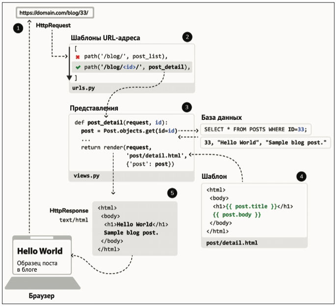

```
pip install django
django-admin startproject mysite
cd mysite 
python manage.py migrate

# Когда нужно запускать приложение в разных окружениях
python manage.py runserver 127.0.0.1:8001 --settings=mysite.settings

python manage.py startapp blog
```

```
 python manage.py shell
 from blog.models import Post
 Post.Status.choices
 Post.Status.labels
 Post.Status.values
 Post.Status.names
```

```
python manage.py makemigrations blog
python manage.py sqlmigrate blog 0001

python manage.py createsuperuser
python manage.py runserver
```

# Создание объектов

```
python manage.py shell

from blog.models import Post
from django.contrib.auth.models import User

post = Post(title='Another post', slug='another-post', body='Post body', author=user)
post.save()
```

или 
```
Post.objects.create(title='One more post', slug='one-more-post', body='Post body', author=user)
```

# Обновление объектов
```
post.title = 'New title'
post.save()
```

# Извлечение объетов
```
all_posts = Post.objects.all()
all_posts
<QuerySet [<Post: One more post>, <Post: New title>, <Post: Hello world>]>
```

фильтр
```
 Post.objects.filter(publish__year=2024)
<QuerySet [<Post: One more post>, <Post: New title>, <Post: Hello world>]>


Post.objects.filter(publish__year=2024,  author__username='admin')
<QuerySet [<Post: One more post>, <Post: New title>, <Post: Hello world>]>
```

```
 Post.objects.filter(publish__year=2024).exclude(title__startswith='Why')
<QuerySet [<Post: One more post>, <Post: New title>, <Post: Hello world>]>
```

```
 Post.objects.order_by('title')
<QuerySet [<Post: Hello world>, <Post: New title>, <Post: One more post>]>

Post.objects.order_by('-title')
<QuerySet [<Post: One more post>, <Post: New title>, <Post: Hello world>]>
```

```
>>> post = Post.objects.get(id=1)
>>> post
<Post: Hello world>
>>> post.delete()
(1, {'blog.Post': 1})
```

# Шаблоны

- ``
- `{{ variable }}`
- `{{ variable|filter }}`

## Docs
- [https://docs.djangoproject.com/en/5.1/ref/templates/language/]()
- Все встроенные теши, переменные и фильтры: [https://docs.djangoproject.com/en/5.1/ref/templates/builtins/]()

